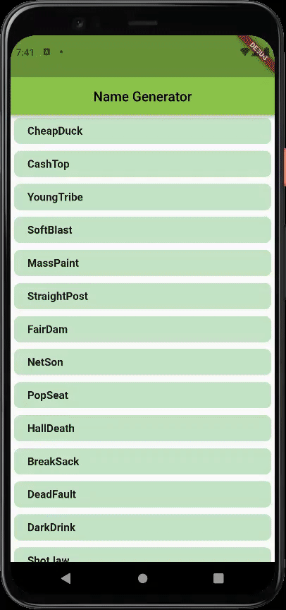

# Layout Basics

In this example, I practiced about how to manage the layout from basics and made a 'Sign in' page.

&emsp; I used the inheritance to make the buttons code's flexible as possible

 

## Images of the App
 

